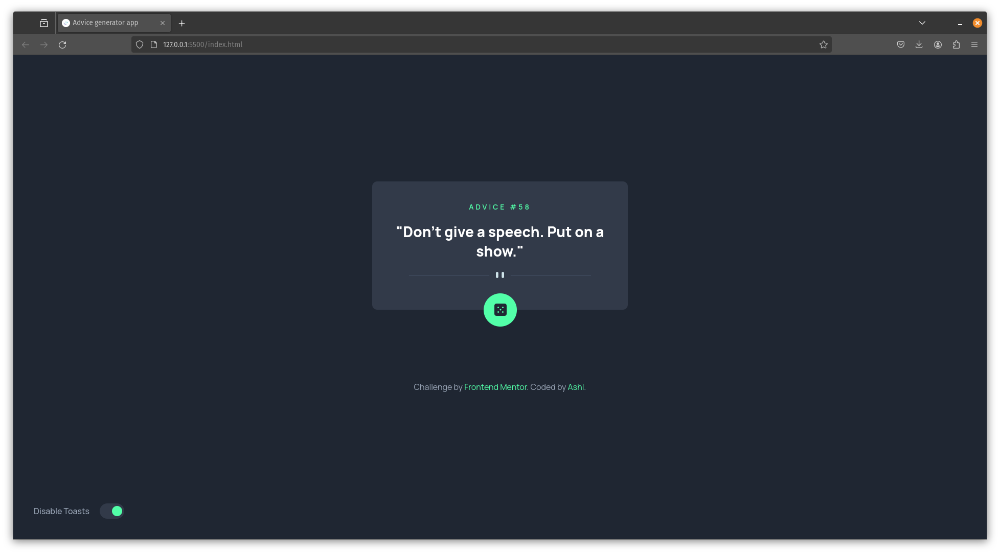
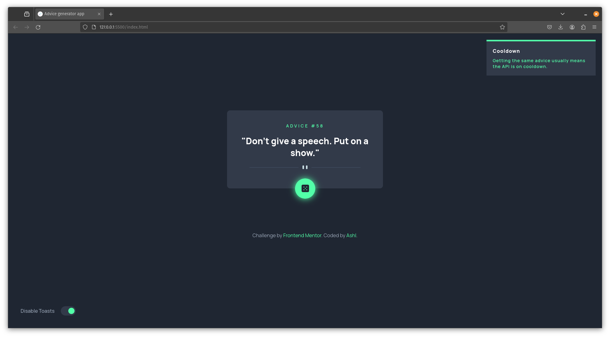
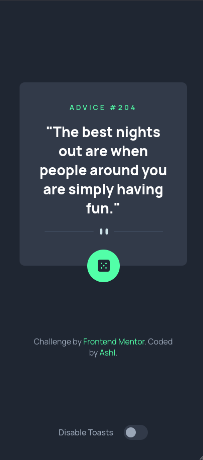

# Frontend Mentor - Advice generator app solution

This is a solution to the [Advice generator app challenge on Frontend Mentor](https://www.frontendmentor.io/challenges/advice-generator-app-QdUG-13db).

## Table of contents

- [Frontend Mentor - Advice generator app solution](#frontend-mentor---advice-generator-app-solution)
  - [Table of contents](#table-of-contents)
  - [Overview](#overview)
    - [Screenshot](#screenshot)
    - [Links](#links)
  - [Process and extra features](#process-and-extra-features)
    - [Spinning dice](#spinning-dice)
    - [Toast component](#toast-component)
    - [Disabling toasts](#disabling-toasts)
  - [Me!](#me)

## Overview

This challenge is supposed to be for people learning to work with APIs. The challenge is to build out an advice generator app and get it looking as close to the design as possible. I already have experience with APIs, so I used this challenge to test the [Frontend Mentor](https://www.frontendmentor.io) platform and see how it works.

### Screenshot

Desktop View

Hover State and Toast component

Mobile View

### Links

- Solution URL: [Add solution URL here](https://your-solution-url.com)

## Process and extra features

As mentioned before, I used this challenge to test the Frontend Mentor platform. I used the provided design and built the app using plain HTML, CSS, and JavaScript. To make the challenge more interesting for me, I added some extra features.

### Spinning dice

Despite the challenge not asking for it, I added a spinning animation to the button when it's clicked. (GIF coming soon)

### Toast component

I also added a toast component that appears when the user clicks the button. The toast component is a small notification that appears at the top  of the screen and disappears after 3 seconds. Multiple toasts stack. The toast component is also animated. (GIF coming soon)

### Disabling toasts

In addition to the toast component, I added a toggle component that allows the user to disable the toast notifications. The user's choice is saved in the local storage, so it persists even after the user refreshes the page.

## Me!

- Frontend Mentor - [@yourusername](https://www.frontendmentor.io/profile/Ashlc)

